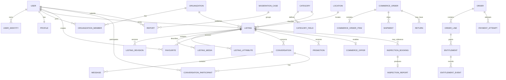
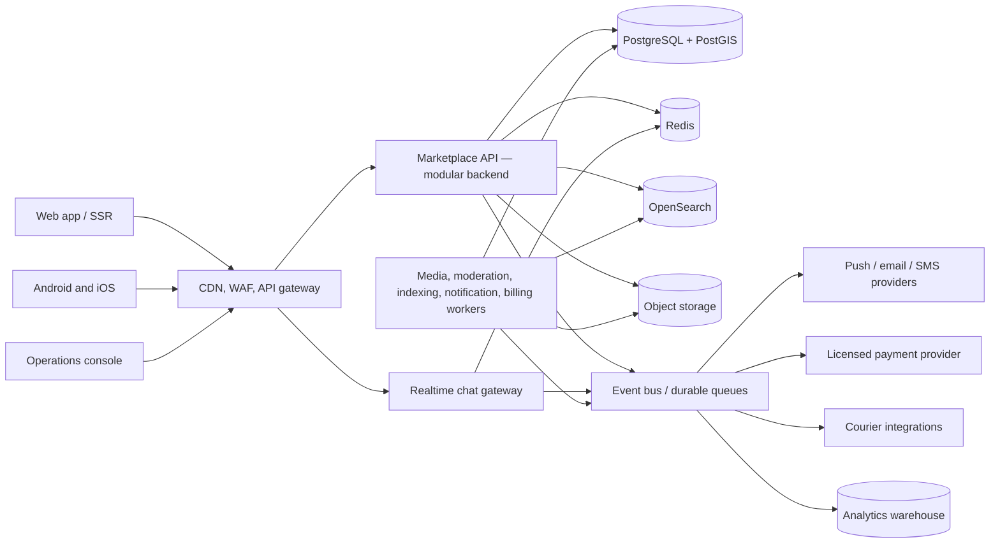

# Pakistan General Marketplace — Product and Implementation Blueprint

**Research date:** 29 June 2026  
**Product type:** Consumer-to-consumer and business-to-consumer classified marketplace  
**Reference product:** OLX Pakistan  
**Document purpose:** Product requirements, system design, delivery plan, and engineering acceptance criteria

> This is an independent implementation blueprint, not a request to copy OLX source code, private APIs, user data, content, branding, or protected design assets. Build a distinct brand and user experience. “OLX” below identifies public behavior observed in the reference product.

---

## 1. Executive decision

Build the platform as a **modular marketplace**, not as one enormous listing table and not as fourteen unrelated vertical applications.

The recommended product has five layers:

1. **Marketplace core:** identity, profiles, taxonomy, locations, listings, media, search, favourites, seller pages, chat, notifications, moderation, and administration.
2. **Category engines:** configuration-driven attributes and filters for mobiles, vehicles, property, jobs, services, animals, furniture, fashion, and other categories.
3. **Revenue engine:** free-ad quotas, paid listings, featured placement, boost-to-top, business subscriptions, invoices, and entitlement tracking.
4. **Trust services:** phone verification, risk scoring, duplicate and prohibited-content detection, reports, appeals, seller verification, and vehicle inspections.
5. **Optional commerce layer:** Buy Now, delivery eligibility, checkout, cash on delivery/card payment, orders, shipments, returns, refunds, and seller settlement for selected new products.

The correct launch sequence is:

- **Release 1:** local classifieds, search, listing management, chat, and moderation.
- **Release 2:** paid promotion, business accounts, storefronts, and stronger trust controls.
- **Release 3:** car inspection and other verified services.
- **Release 4:** managed delivery and checkout for approved professional sellers.

Trying to launch all four releases together would combine marketplace liquidity risk, payment risk, logistics risk, fraud risk, and operational-support risk. It is technically possible, but commercially unwise.

---

## 2. What was observed in the current reference product

### 2.1 Evidence standard

This blueprint distinguishes:

- **Observed:** directly present on current public OLX pages or current OLX help material.
- **Inferred:** behavior strongly implied by the public user interface but not publicly documented internally.
- **Recommended:** architecture or functionality proposed for this implementation.

No claim is made about OLX’s private codebase, database, vendors, internal services, ranking model, or infrastructure.

### 2.2 Public feature inventory

| Area | Current public behavior | Evidence | Implementation conclusion |
|---|---|---|---|
| Discovery | Keyword and location search, category navigation, category-specific filters, counts, list/grid views, and sorting | [OLX homepage](https://www.olx.com.pk/), [all listings](https://www.olx.com.pk/items) | Search must be faceted, geospatial, typo-tolerant, and category aware. |
| Category breadth | Mobiles, vehicles, sale/rent property, electronics, bikes, business/industry/agriculture, services, jobs, animals, furniture, fashion, books/hobbies, and kids | [OLX homepage taxonomy](https://www.olx.com.pk/) | Category taxonomy and fields must be data, not hard-coded page logic. |
| Mobile filters | Brand/model, condition, PTA status, price, and location | [mobile-phone results](https://www.olx.com.pk/mobile-phones_c1453/q-mobiles-) | Nested brand/model and Pakistan-specific PTA status are required. |
| Vehicle filters | Brand/model, condition, mileage, year, fuel, transmission, body type, features, registration city, documents, and assembly | [cars results](https://www.olx.com.pk/cars_c84) | Vehicles need a rich normalized vertical schema and a car reference catalog. |
| Property filters | Price, furnishing, bedrooms, bathrooms, features, construction state/floor, area unit, and area | [houses](https://www.olx.com.pk/houses_c1721), [apartments](https://www.olx.com.pk/apartments-flats_c1723), [plots](https://www.olx.com.pk/land-plots_c40) | Property requires normalized area values plus localized units such as marla and kanal. |
| Listing | Title, category/subcategory, category fields, price, up to 12 images, description, location, seller information, preview, and post | [how to post an ad](https://help.olx.com.pk/hc/en-us/articles/35618845033745-How-do-I-post-an-ad) | Use a multi-step draft with server-side validation and media scanning. |
| Lifecycle | Listings can be edited, deleted, marked sold, rejected, expire, or remain pending | [edit/delete](https://help.olx.com.pk/hc/en-us/articles/35618749850897-How-can-I-delete-or-edit-my-ad), [pending](https://help.olx.com.pk/hc/en-us/articles/35617513943441-Why-isn-t-my-ad-active-It-says-pending), [removed](https://help.olx.com.pk/hc/en-us/articles/35617496742161-Why-was-my-ad-removed) | Listing state must be an explicit audited state machine. |
| Buyer contact | Login is required to contact sellers; listing pages expose chat and, depending on seller/listing, call/SMS/WhatsApp | [contact seller](https://help.olx.com.pk/hc/en-us/articles/35638507058961-How-can-I-contact-a-Seller), [car listing example](https://www.olx.com.pk/item/toyota-raize-20202026-iid-1109044484) | Contact exposure must respect seller preferences, risk rules, and verified-phone status. |
| Chat | Presence/last seen, read receipts, voice messages, images, location, call/SMS actions, block/delete, and reports | [new OLX chat](https://help.olx.com.pk/hc/en-us/articles/35638302862865-What-is-the-way-for-New-OLX-chat), [read receipts](https://help.olx.com.pk/hc/en-us/articles/35638265963281-How-do-I-see-if-someone-has-read-my-message) | Real-time messaging is a first-class subsystem, not a comment field. |
| Profiles/network | Profiles, bio, seller ads, and a follow/network concept whose members can be notified of new ads | [profile editing](https://help.olx.com.pk/hc/en-us/articles/35617182710673-What-about-profile-edition), [My Network](https://help.olx.com.pk/hc/en-us/articles/35617241803537-What-is-My-Network) | Follow-seller can be P1; seller pages are P0. |
| Ad analytics | Sellers see views and favourites | [ad views](https://help.olx.com.pk/hc/en-us/articles/35617619691665-How-do-I-know-people-are-viewing-my-ads) | Store privacy-safe impression, detail-view, favourite, lead, and chat-start aggregates. |
| Free quotas | Free posting limits apply over rolling 30/60-day windows; deletion does not restore quota | [free ad limits](https://help.olx.com.pk/hc/en-us/articles/35616137267985-All-about-Free-Ad-Limits) | Quotas need an immutable usage ledger, not an “active listing count.” |
| Featured ads | Paid 7/14/30-day placements appear in a separate/top section with a featured tag | [featured ads](https://help.olx.com.pk/hc/en-us/articles/35616084165905-What-are-Featured-Ads), [feature flow](https://help.olx.com.pk/hc/en-us/articles/35616007746065-How-to-feature-a-New-Ad) | Promotion is a dated entitlement with placement rules and order history. |
| Business packages | Category-bound discounted bundles of paid ads and featured placements | [business packages](https://help.olx.com.pk/hc/en-us/articles/35615952879505-How-to-buy-Featured-Ads-Business-Packages), [post more ads](https://help.olx.com.pk/hc/en-us/articles/35616211959953-How-to-post-more-Ads) | Build product catalog, purchases, credits, entitlements, and consumption ledger. |
| Payments | Cards, JazzCash, EasyPaisa/PayFast, bank transfer and, in selected cities, cash collection are publicly documented | [payment methods](https://help.olx.com.pk/hc/en-us/articles/35638189354001-What-are-Payment-Methods) | Start with one licensed PSP and webhook-driven payment state; never store raw card data. |
| Delivery commerce | Selected new items from trusted sellers have a delivery filter, Buy Now, address capture, COD/card, place order, and nationwide delivery | [Buy with Delivery guide](https://blog.olx.com.pk/featured/how-to-get-brand-new-products-delivered-to-your-doorstep-with-olx/), [delivery results](https://www.olx.com.pk/items/q-buy-with-delivery) | This is a controlled B2C commerce lane, separate from ordinary peer-to-peer classifieds. |
| Vehicle inspection | Scheduling at a location/center, 200+ checkpoints, and an eight-page report | [inspection flow](https://help.olx.com.pk/hc/en-us/articles/35616744012049-How-to-schedule-an-OLX-Car-Inspection) | Inspection needs bookings, inspectors, checklists, evidence, report generation, and listing linkage. |
| Safety | Ad/user reporting, blocking, suspicious-user warnings, fraud tips, duplicate detection, prohibited-item rules, and account sanctions | [fraud indicators](https://help.olx.com.pk/hc/en-us/articles/35614055586577-How-do-I-know-if-it-s-a-Fraud), [suspicious user](https://help.olx.com.pk/hc/en-us/articles/35613725293841-What-does-Suspicious-User-Detected-mean), [prohibited items](https://help.olx.com.pk/hc/en-us/articles/35618439136273-Which-items-are-not-allowed-on-OLX) | Trust and safety requires automated rules plus a human case-management console. |
| Mobile | Android/iOS apps advertise nearby discovery, verified sellers, direct chat, ad management, alerts, and recommendations | [Google Play](https://play.google.com/store/apps/details?id=com.olx.pk), [Apple App Store](https://apps.apple.com/pk/app/olx-pakistan-online-shopping/id1551315538) | Native-quality mobile behavior and push notifications are required for parity. |

### 2.3 Important limitation of the reference model

The ordinary classified flow is primarily a **lead-generation marketplace**. Buyer and seller negotiate and transact with each other; the platform is not automatically the merchant of record or escrow agent. The newer delivery lane adds an order flow for selected new goods. Keep these contractual and technical models separate.

---

## 3. Product definition

### 3.1 Product vision

Create Pakistan’s trusted local marketplace where individuals and businesses can list, discover, discuss, verify, buy, sell, rent, hire, or book almost any lawful product or service.

### 3.2 Primary actors

| Actor | Main need |
|---|---|
| Guest buyer | Browse, search, filter, compare, and inspect seller/listing trust signals. |
| Registered buyer | Favourite, follow, chat, call, report, receive alerts, and place eligible delivery orders. |
| Casual seller | Post a small number of used items, manage leads, and mark items sold. |
| Professional seller/dealer | Bulk inventory, storefront, staff access, analytics, subscriptions, featured products, and optional delivery. |
| Job poster/service provider/agent | Publish vertical-specific offers and handle leads. |
| Moderator | Review listings, media, users, chat reports, and appeals. |
| Support agent | Resolve account, payment, listing, order, and inspection cases. |
| Finance operator | Reconcile payments, issue refunds/invoices, and manage seller settlements. |
| Inspection operator | Schedule, assign, execute, review, and publish inspection reports. |
| System administrator | Configure taxonomy, fields, quotas, prices, policies, experiments, and permissions. |

### 3.3 Goals

- A seller can publish a valid listing in under three minutes on a mid-range mobile connection.
- A buyer can narrow a broad category to relevant local results without learning category jargon.
- Contact and negotiation remain inside the platform whenever possible.
- Obvious scams, duplicates, prohibited goods, and abusive users are intercepted before harm.
- Paid promotion is transparent, measurable, auditable, and does not destroy organic relevance.
- New verticals can be introduced through configuration and reference data, without a new codebase.
- The platform supports web, Android, and iOS with consistent domain rules.

### 3.4 Non-goals for the first release

- Universal escrow between arbitrary consumers.
- In-house wallet, stored value, lending, insurance underwriting, or payment-switch operation.
- Warehousing every product.
- International cross-border trade.
- Fully automatic moderation with no appeal path.
- Copying OLX branding, copyrighted content, HTML, design, SEO pages, listings, or user base.

### 3.5 North-star and guardrail metrics

**North star:** successful marketplace connections per weekly active user.

A successful connection is a qualified chat, revealed call, accepted offer, delivery order, booked inspection, or seller-confirmed sale, deduplicated per buyer/listing/day.

**Supply metrics:** published listings, publish completion, approval time, active supply, unique sellers, sell-through, time to first lead.  
**Demand metrics:** searches, search-to-detail rate, zero-result rate, favourite rate, contact rate, return visits.  
**Liquidity:** median qualified leads/listing, median time to first lead, category/city sell-through.  
**Trust:** reports per 1,000 contacts, confirmed fraud rate, false-positive moderation rate, appeal overturn rate, spam chat rate.  
**Revenue:** payer conversion, ARPPU, package utilization, renewal, promotion lift, refunds/chargebacks.  
**Reliability:** availability, search latency, chat delivery latency, crash-free sessions, notification delay.

---

## 4. Product surfaces and navigation

### 4.1 Public web

- Home with location, universal search, category shortcuts, recommended/local sections, and promotional modules.
- Search results with breadcrumbs, query, location scope, category facets, category-specific filters, result count, sort, list/grid switch, favourites, and promoted disclosure.
- SEO category/city/brand/model pages using canonical URLs.
- Listing detail with media gallery, price, structured attributes, description, location, safety advice, seller card, actions, listing ID, report/share/favourite, and related listings.
- Seller or business profile with join date, verification, response indicators, active listings, storefront metadata, and report/follow actions.
- Informational pages: safety, prohibited goods, terms, privacy, cookies, help, packages, inspections, and delivery terms.

### 4.2 Authenticated web/app

- Home/personalized feed.
- Search history and saved searches.
- Favourites and followed sellers.
- Chat inbox and conversation view.
- Post/edit listing flow.
- My Listings: drafts, pending, active, rejected, expired, sold, deleted.
- Orders and promotion orders.
- Account/profile, phone/email verification, privacy, notification preferences, blocked users, support, and data controls.

### 4.3 Business console

- Business profile and branches.
- Inventory table, bulk import, validation errors, staff roles, lead inbox, analytics, package balance, orders, settlements, and invoices.
- Delivery catalog eligibility, stock, SKU, price/discount, shipping dimensions, return rules, and fulfilment status.

### 4.4 Operations console

- Queues for listings, users, reports, payments, orders, inspections, appeals, and legal requests.
- Searchable entity timeline with immutable staff audit events.
- Rule configuration, category configuration, pricing, quotas, CMS, feature flags, and experiments.

---

## 5. Functional requirements

Priority meanings: **P0** launch blocking, **P1** full marketplace parity, **P2** optimization or vertical expansion.

### 5.1 Identity and account security

#### P0 requirements

- Browse without authentication; require authentication for post, favourite sync, contact, report, and order.
- Pakistan mobile-number registration with OTP and abuse controls.
- Email/passwordless link or verified email registration.
- Google and Apple sign-in; Facebook only if product/legal review approves it.
- One canonical account can own multiple verified identifiers.
- Session management with rotating refresh tokens, device list, remote logout, and revocation.
- Rate limits by IP, device, phone, account, ASN risk, and action.
- Profile: display name, 200-character bio, avatar, general location, join date, verification badges, and contact preferences.
- Account deletion/deactivation and data request workflow.
- Age gate and restricted-category controls.

#### P1 requirements

- Account-linking recovery flow preventing duplicate identity graphs.
- Optional CNIC/business verification through an approved provider; do not expose CNIC.
- Risk-based step-up verification for high-risk posting or payment actions.
- Professional business verification, tax/business documents, beneficial-owner review as legally required.

#### Acceptance criteria

- OTPs expire, are single use, never logged in plaintext, and cannot be brute-forced.
- A blocked account cannot recreate access with the same verified phone without a review outcome.
- Linking two identities requires proof of control of both; conflicting existing accounts enter recovery review.
- All sensitive account changes create security notifications and audit events.

### 5.2 Taxonomy, dynamic forms, and reference catalogs

- Maintain a versioned category tree with stable IDs, localized labels, parent/child relations, icons, sort order, active state, and policy flags.
- Define fields per category through configuration: type, label, unit, help text, validation, required state, searchable/facetable state, option source, dependencies, display order, and moderation rules.
- Reuse reference catalogs for car makes/models, mobile brands/models, Pakistan administrative geography, property features, and condition values.
- Support field migrations without corrupting old listings.
- Preserve a listing’s schema version and normalized values.
- Allow category-specific price rules: exact, negotiable, range, free, salary, rent period, or “contact for price,” only where policy permits.
- Store units in a canonical internal form while displaying local units.

**Architecture rule:** no new database column and app release should be required for every new category option.

### 5.3 Location model

- Hierarchy: country → province/territory → district/city → locality/area/society/block.
- Optional approximate coordinates and map pin.
- Search by current location, named place, administrative boundary, or radius.
- Privacy: public display uses locality/city; exact seller address is never exposed for ordinary classifieds.
- Delivery address is private order data with separate access control and retention.
- Normalize spelling variants and Urdu/Roman Urdu aliases.
- Use PostGIS for containment, proximity, and map-bound queries.

### 5.4 Listing creation

#### Draft flow

1. Start draft and select category/subcategory.
2. Enter title and category attributes.
3. Enter price or category-specific compensation.
4. Upload/reorder/delete media.
5. Enter description and condition.
6. Choose location.
7. Select contact options and validate seller information.
8. Preview.
9. Run quota/entitlement and policy checks.
10. Submit for moderation.

#### Rules

- Autosave on every meaningful step and recover drafts across devices.
- Up to 12 images initially; configurable by category/package.
- JPEG/PNG/WebP/HEIC intake; strip unsafe metadata, orient, resize, transcode, and generate variants.
- Video can be P2, with strict duration/size and malware/transcoding pipeline.
- Reject executable payloads and suspicious polyglot files.
- Detect duplicate/perceptually similar images, copied catalog images, contact details in images, and unsafe content.
- Enforce title/description length, price sanity bands, required category fields, and prohibited terms.
- Store original seller input for appeal/audit, but display sanitized content.
- Phone numbers/URLs in description follow category and verification policy.
- Quota consumption is evaluated at publication attempt and recorded in an immutable ledger.
- Offer paid posting only after free allowance is unavailable; show the rule before checkout.

#### Acceptance criteria

- Closing and reopening the app restores the draft with media order.
- The final submit endpoint is idempotent.
- Duplicate tapping cannot create duplicate listings or double-consume a paid credit.
- Validation errors link directly to the correct step and field.
- A submitted listing is never silently lost; it has a visible state and reason.

### 5.5 Listing lifecycle

States:

```text
DRAFT → SUBMITTED → AUTOMATED_REVIEW → PENDING_HUMAN_REVIEW → ACTIVE
                                   ↘ REJECTED ↔ APPEALED
ACTIVE → SOLD | EXPIRED | DEACTIVATED | REMOVED
EXPIRED → RENEWAL_PENDING → ACTIVE
```

- Every transition records actor, reason code, timestamp, previous/new state, rule/model version, and optional case ID.
- Editing material fields on an active listing creates a revision; high-risk changes return to review.
- Mark sold preserves private history and removes the listing from ordinary search.
- Soft deletion precedes retention expiry; legal holds override deletion jobs.
- Scheduled expiry is configurable; parity baseline is 30 days.
- Renewal never bypasses quota and moderation rules.
- Do not allow editing a paid listing into a different product to reuse an entitlement.

### 5.6 Listing detail and seller page

Listing detail must include:

- Image gallery with count, thumbnails, zoom, and accessible alt text.
- Price/price type and promotion labels.
- Title, locality/city, publish/refresh age, structured details, description, and listing ID.
- Seller card: display name/business, join date, verification, response indicators, active ad count, and profile link.
- Favourite, share, report, chat, reveal-call, SMS/deep link, and WhatsApp where eligible.
- Map displaying an approximate area, never the private address.
- Safety reminders targeted to the category and transaction mode.
- Similar listings, same seller listings, and recently viewed items.
- Inspection badge/report or delivery eligibility when applicable.

Seller page must include active inventory, business metadata, branches/service area, follow, report, verification, and paginated results. Never expose private contact or moderation information.

### 5.7 Search, browse, and recommendation

#### Query features

- Full-text search across title, description, category, brand/model, location aliases, and selected attributes.
- Roman Urdu/Urdu/English normalization, case folding, plural handling, spelling correction, synonyms, and transliteration dictionary.
- Typeahead for categories, products, makes/models, and locations.
- Category and location inference from query.
- Facets with counts and dependent filters.
- Geospatial radius and administrative-area filters.
- Sort: relevance, newest, price low/high, distance, and vertical-specific options.
- Search index updates within 60 seconds of publish/edit/removal; removal target under 10 seconds for safety actions.
- Cursor pagination; never deep offset at scale.

#### Ranking

Organic ranking should combine:

```text
text relevance
+ category match
+ geographic proximity
+ freshness decay
+ listing completeness/quality
+ seller trust and responsiveness
+ engagement quality
- duplication/spam risk
- stale/low-quality penalty
```

Promoted results are inserted by a separately audited placement policy. They must be clearly labeled and still satisfy query/category/location/safety constraints.

#### Recommendation safety

- Cold start: popular and fresh items in selected location/categories.
- Personalization from category/search/detail/favourite/contact behavior.
- Do not infer sensitive traits.
- Provide history controls and a personalization opt-out where required.
- Fraud or prohibited content can never be rescued by engagement ranking.

### 5.8 Favourites, history, saved search, and following

- Favourite/unfavourite with cross-device sync and optimistic UI.
- Recently viewed list with privacy controls and expiration.
- Saved search captures query, filters, location, cadence, and push/email preference.
- Notify on meaningful new matches; deduplicate and rate-limit alerts.
- Follow seller/business with optional new-listing notifications.
- Sellers see aggregate favourite counts, not the identities of all favouriting users.

### 5.9 Chat and communications

#### Conversation model

- One buyer/seller/listing conversation by default, with archived history when listing state changes.
- Text, image, voice note, safe location share, system messages, and future structured offers.
- Online/last-seen privacy setting, delivered/read receipts, typing indicators, unread counters, block, delete-for-self, report user, and report listing.
- Message attachment scanning and signed, expiring URLs.
- Push notifications with privacy-safe text on locked devices.
- Conversation survives listing edits but displays a snapshot of the originally contacted listing.

#### Safety controls

- Detect and warn on advance-payment solicitation, off-platform migration pressure, suspicious URLs, financial details, repeated spam, impersonation, and abusive language.
- Risk warnings must be explainable and must not reveal detection internals.
- Blocking stops future messages/calls through platform relay, hides presence, and suppresses follower notifications.
- High-risk conversations can be throttled or placed in review consistent with terms and law.
- Retain reported conversation evidence under a defined case-retention schedule.

#### Technical behavior

- WebSocket connection for foreground delivery; durable event stream/queue for fan-out; push fallback for offline users.
- Client-generated message ID plus server idempotency.
- Per-conversation sequence number preserves ordering.
- Delivery target: 99% of online text messages under 2 seconds.
- Offline retry does not duplicate messages.

### 5.10 Calls and contact privacy

- Seller selects chat-only, reveal verified phone, or professional WhatsApp eligibility.
- Reveal requires authenticated, rate-limited buyer and records a privacy-safe lead event.
- Prefer call relay/masked numbers in high-risk categories if economically feasible.
- Prevent bulk enumeration of phone numbers.
- Do not render phone in indexable HTML or public APIs.
- Show off-platform risk warning before WhatsApp handoff.

### 5.11 Trust, moderation, and policy enforcement

#### Pre-publication checks

- Account/device reputation.
- Rate/velocity anomalies.
- Duplicate title/image/product/location detection.
- Prohibited goods and regulated-category rules.
- Counterfeit/trademark signals.
- Unrealistic price detection using category/city bands.
- Contact detail and external-link policy.
- Image safety, OCR, malware, and perceptual hashes.
- Known scam phrase and phone/account graph matches.
- Seller/listing mismatch and mass-posting behavior.

#### Outcomes

- Allow.
- Allow with lower exposure.
- Request correction.
- Queue for human review.
- Reject with reason and appeal path.
- Remove after publication.
- Limit an account action.
- Suspend/ban account and connected high-confidence abusive entities.

#### Reports and cases

- Report listing or user; reason taxonomy, description, attachments, acknowledgement, status, and resolution.
- One case may link users, listings, messages, payments, devices, and prior cases.
- Moderators have least-privilege views; sensitive fields are masked unless required.
- Four-eyes approval for high-impact permanent bans, legal disclosure, and large financial adjustments.
- Appeals are reviewed by a different operator/queue when possible.

#### Mandatory admin audit

Record every staff view of sensitive records, search, export, policy action, refund, role change, and configuration change. Audit logs are append-only and separately retained.

### 5.12 Monetization and entitlement ledger

Products:

- Single paid listing.
- Listing-credit bundles by category and validity.
- Featured placement for 7/14/30 days.
- Boost-to-top credits or scheduled boosts.
- Business subscription/storefront tiers.
- Premium support, lead tools, analytics, bulk import, and optional verified badges.
- Vehicle inspection booking.
- Optional delivery commission and seller service fee.

Core entities:

```text
Product → Price → Order → PaymentAttempt → Payment
                         ↘ Invoice/Refund
OrderLine → Entitlement → ConsumptionEvent
PromotionCampaign → PlacementEvent → PerformanceAggregate
```

Rules:

- Use an append-only entitlement and consumption ledger.
- Order and payment states are separate.
- Payment webhooks are signed, verified, replay-protected, and idempotent.
- Promotion starts only after confirmed payment and approved active listing.
- If listing approval is delayed, entitlement timing follows published terms.
- Category-bound credits cannot be consumed elsewhere.
- Staff adjustments require reason and audit.
- Invoice/tax handling is configurable by jurisdiction and reviewed by Pakistan tax counsel.

### 5.13 Business sellers and storefronts

- Business onboarding and verification.
- Organization with owner, admin, inventory manager, sales agent, finance, and analyst roles.
- Branches, service areas, opening hours, logo/banner, business description, and verified contacts.
- Storefront URL and inventory filters.
- Staff-level audit and optional lead assignment.
- CSV/XLSX import with dry run, row errors, category mapping, media URLs, idempotent external SKU, and update mode.
- API/feed integration only after seller and security review.
- Inventory analytics and package balance.
- Optional public WhatsApp, warranty, return, and delivery information.

### 5.14 Buy with Delivery

Treat this as a separate, allow-listed channel.

#### Eligibility

- Verified professional seller.
- Supported category and brand-new product.
- Fixed price, stock/SKU, weight/dimensions, return policy, serviceable pickup, and valid settlement details.
- Moderation and counterfeit-risk thresholds passed.

#### Buyer flow

1. Enable Delivery filter or open eligible product.
2. Review price, discount, stock, delivery estimate, seller, policy, and Buy Now.
3. Authenticate/verify phone.
4. Add recipient and serviceable address.
5. Choose COD or PSP-hosted card/wallet payment.
6. Review totals and place idempotent order.
7. Track confirmed → packed → handed over → in transit → delivered.
8. Request cancellation/return within policy.

#### Seller/operations flow

- Accept/auto-confirm, pick/pack SLA, shipping label, carrier handoff, tracking, delivery proof, COD reconciliation, return-to-origin, and settlement.
- Reservation prevents overselling; reservation expires if payment/confirmation fails.
- Order state and payment state are independent.
- Webhook reconciliation handles out-of-order carrier events.
- Settlement is delayed until delivery/return risk window according to contract.

#### Exclusions

- Do not offer “platform guaranteed delivery” on ordinary used C2C listings until escrow, inspection, returns, identity, and dispute operations are mature.

### 5.15 Vehicle inspections

- Book by listing/vehicle, location or center, preferred slot, contact, and payment.
- Capacity calendar by city, center, inspector skill, and travel time.
- Assignment, reschedule, cancellation, no-show, and refund rules.
- Versioned 200+ point checklist with required photos/video, readings, notes, severity, and pass/attention status.
- Inspector app works offline and synchronizes with conflict rules.
- QA reviewer locks the report; later corrections create a new version.
- Signed PDF and structured report; listing badge links to the current report.
- Report states who commissioned it, inspection date, vehicle identity, limitations, and expiry/freshness.
- Prevent seller from replacing the inspected vehicle identity or materially editing it without invalidating the badge.

### 5.16 Notifications

Channels: in-app, push, email, SMS, and operational WhatsApp only through approved templates/provider if desired.

Events:

- OTP/security changes.
- Listing submitted/approved/rejected/expiring/expired/sold.
- New chat/message/offer.
- Saved-search match and followed-seller listing.
- Package purchase, credit expiry, payment/refund/invoice.
- Order and delivery updates.
- Inspection booking/reminder/report.
- Report/appeal/support updates.

Use a template service with locale, channel policy, preference, quiet hours, deduplication, rate limit, retry, bounce handling, and delivery receipts. Transactional/security notices cannot be suppressed where required.

### 5.17 Admin and support

Minimum modules:

- User 360 and business 360.
- Listing/revision/media viewer.
- Search and ranking diagnostics.
- Moderation queues and case management.
- Reports, appeals, sanctions, and policy reason management.
- Chat evidence viewer gated by case and role.
- Package/order/payment/refund/invoice view.
- Delivery order/return/settlement view.
- Inspection booking/report QA.
- Taxonomy, dynamic fields, reference catalogs, locations, quotas, prices, and promotion configuration.
- CMS, SEO redirects, banners, safety content, and help pages.
- Role/permission management and audit explorer.
- Feature flags, experiments, health dashboards, and incident banner.

---

## 6. Category taxonomy baseline

The current public top-level taxonomy should be treated as a **market reference**, then reviewed for legal risk, local demand, and brand strategy before launch.

| Top category | Subcategories observed publicly |
|---|---|
| Mobiles | Mobile Phones; Accessories; Tablets; Smart Watches; Landline Phones |
| Vehicles | Cars; Car Accessories; Spare Parts; Car Care; Rickshaw & Chingchi; Buses, Vans & Trucks; Tractors & Trailers; Oil & Lubricants; Cars on Installments; Other Vehicles; Boats |
| Property for Sale | Land & Plots; Houses; Apartments & Flats; Shops/Offices/Commercial Space; Portions & Floors |
| Property for Rent | Houses; Apartments & Flats; Portions & Floors; Shops/Offices/Commercial Space; Rooms; Vacation Rentals/Guest Houses; Roommates & Paying Guests; Land & Plots |
| Electronics & Home Appliances | Computers & Accessories; AC & Coolers; Generators/UPS/Power; Refrigerators & Freezers; Televisions & Accessories; Games & Entertainment; Kitchen Appliances; Cameras & Accessories; Video-Audios; Other Home Appliances; Fans; Washing Machines & Dryers; Tools & DIY; Microwaves & Ovens; Sewing Machines; Heaters & Geysers; Water Dispensers; Irons & Steamers; Air Purifiers & Humidifiers |
| Bikes | Motorcycles; Bicycles; Spare Parts; Scooters; Bike Accessories; ATV & Quads; Bike Care |
| Business, Industrial & Agriculture | Other Business & Industry; Food & Restaurants; Medical & Pharma; Trade & Industrial Machinery; Business for Sale; Construction & Heavy Machinery; Agriculture |
| Services | Other Services; Tuitions & Academies; Home & Office Repair; Car Rental; Domestic Help; Web Development; Electronics & Computer Repair; Drivers & Taxi; Construction Services; Consultancy; Farm & Fresh Food; Movers & Packers; Travel & Visa; Architecture & Interior Design; Health & Beauty; Video & Photography; Event Services; Renting; Camera Installation; Car Services; Catering & Restaurant; Tailor Services; Insurance Services |
| Jobs | Other Jobs; Online; Part Time; Sales; Restaurants & Hospitality; Domestic Staff; Customer Service; Marketing; Education; Medical; Delivery Riders; IT & Networking; Accounting & Finance; Graphic Design; Engineering; Hotels & Tourism; Clerical & Administration; Manufacturing; Security; Content Writing; Internships; Human Resources; Advertising & PR; Real Estate; Architecture & Interior Design |
| Animals | Hens; Cats; Parrots; Pet Food & Accessories; Dogs; Livestock; Pigeons; Rabbits; Other Birds; Fish; Finches; Ducks; Fertile Eggs; Other Animals; Peacocks; Doves; Horses |
| Furniture & Home Decor | Beds & Wardrobes; Sofa & Chairs; Other Household Items; Tables & Dining; Office Furniture; Home Decoration; Kitchen Essentials; Garden & Outdoor; Home DIY & Renovations; Bathroom Accessories; Paintings & Mirrors; Curtains & Blinds; Rugs & Carpets; Lighting; Home Essentials |
| Fashion & Beauty | Clothes; Watches; Skin & Hair; Wedding; Footwear; Jewellery; Bags; Fragrance; Makeup; Bath & Body; Fashion Accessories; Other Fashion; DIY Jewellery |
| Books, Sports & Hobbies | Books & Magazines; Gym & Fitness; Sports Equipment; Other Hobbies; Arts & Crafts; Musical Instruments; Camping & Hiking; Collectables; Crafts & DIY Supplies; Calendars |
| Kids | Toys; Kids Vehicles; Baby Gear; Kids Furniture; Swings & Slides; Kids Accessories; Kids Clothing; Bath & Diapers |

### 6.1 Field families

| Vertical | Required structured fields |
|---|---|
| Generic goods | condition, price type, brand optional, negotiable, delivery eligibility controlled |
| Mobile phones | brand, model, condition, PTA status, storage/RAM optional, warranty, SIM type optional |
| Cars | make, model, variant, year, mileage, fuel, transmission, body type, registration city, documents, assembly, color, seats, owners, features |
| Motorcycles | make, model, year, mileage, engine capacity, condition, registration, documents |
| Houses/apartments | sale/rent, furnishing, bedrooms, bathrooms, area value/unit, construction state, floor, features |
| Plots | plot type, area value/unit, utilities/features, ownership/file status, possession optional |
| Jobs | employer, role type, workplace mode, position type, salary range/period, experience, education, apply method, expiry |
| Services | service type, service area, provider type, price model, availability, credentials where regulated |
| Animals | species/breed, age, sex, vaccinated/health statements, purpose; strict wildlife/endangered-species controls |
| Delivery catalog | SKU, new condition, fixed price, compare-at price, stock, weight/dimensions, warranty, return policy, tax class |

The companion JSON file in this delivery shows how these schemas can be represented in configuration.

---

## 7. Domain model

### 7.1 Core entity map



### 7.2 Data-storage strategy

- **PostgreSQL:** source of truth for users, listings, taxonomy, orders, entitlements, cases, and configuration.
- **PostGIS:** locations, boundaries, distance, and map search.
- **OpenSearch:** denormalized searchable listing documents and aggregations.
- **Redis:** short-lived sessions, rate limits, locks, idempotency cache, presence, and hot counters—not durable business truth.
- **Object storage + CDN:** listing media, voice notes, reports, exports, and generated assets.
- **Durable event bus/queue:** index updates, notifications, media processing, moderation, analytics, payment/carrier events, and integration retries.
- **Analytics warehouse:** immutable event stream transformed for BI and experiments; it must not become the transactional source of truth.

### 7.3 Multi-tenancy decision

This is a marketplace with many sellers, not conventional tenant-isolated SaaS. Use one marketplace data plane with organization-scoped access. If the business later sells white-label marketplaces, create true tenant boundaries deliberately; do not overload `organization_id` as a security boundary without redesign.

---

## 8. Recommended architecture

### 8.1 Starting shape: modular monolith plus workers

Begin with a well-separated modular backend deployed as one API application, one real-time gateway, and several worker processes. Extract services only when scale, ownership, or failure isolation justifies it.

This is preferable to day-one microservices because transactions such as listing publication, quota consumption, promotion activation, and order creation cross several concepts and require correctness more than organizational ceremony.

### 8.2 Logical architecture



### 8.3 Suggested technology choices

Versions should be pinned to supported releases during implementation, not copied from this research date.

| Layer | Recommendation | Reason |
|---|---|---|
| Web | React framework with SSR/streaming, TypeScript | SEO category/listing pages, shared types, mature ecosystem |
| Mobile | React Native or Flutter | One team for Android/iOS; retain native escape hatches |
| Backend | NestJS/TypeScript, Kotlin/Spring, or Go | Pick one ecosystem the senior team can operate; modularity matters more than fashion |
| Transaction DB | Managed PostgreSQL with PostGIS | Relational integrity, JSONB flexibility, geography, mature operations |
| Search | Managed OpenSearch/Elasticsearch-compatible service | Full-text, facets, geospatial search, ranking controls |
| Cache/ephemeral | Managed Redis | Rate limits, presence, hot keys, locks, short-lived cache |
| Async | Managed Kafka for high scale, or cloud queues/topics initially | Durable asynchronous workflows and replay |
| Media | S3-compatible object store, CDN, image transformer | Secure scalable uploads and variants |
| Auth | In-house identity domain using vetted libraries or regional identity provider | OTP/social linking and risk rules are marketplace specific |
| Payments | Hosted checkout/tokenization through SBP-compliant licensed provider | Reduce PCI and regulatory scope |
| Infra | One major cloud/region initially, infrastructure as code, managed databases | Smaller operational surface and reproducible recovery |

### 8.4 Backend modules

```text
identity
profiles
organizations
taxonomy
locations
listings
media
search
favourites-history-follows
chat
notifications
trust-risk
moderation-cases
catalog-pricing
orders-payments-invoices
entitlements-promotions
commerce-orders-shipments-returns-settlements
inspections
support-admin-cms
analytics-experiments
```

Each module owns its write model and publishes domain events. Cross-module reads can use explicit query services; direct table access should be limited and documented even inside the monolith.

### 8.5 Event examples

```text
UserRegistered
PhoneVerified
ListingSubmitted
ListingApproved
ListingActivated
ListingEdited
ListingRemoved
ListingExpired
ListingMarkedSold
ConversationStarted
MessageSent
ReportSubmitted
ModerationCaseResolved
PaymentConfirmed
EntitlementGranted
EntitlementConsumed
PromotionStarted
CommerceOrderPlaced
ShipmentStatusChanged
ReturnRequested
InspectionCompleted
```

Every event has a unique ID, aggregate ID/version, occurred-at time, producer, schema version, trace ID, and privacy classification. Consumers are idempotent.

---

## 9. API design

### 9.1 Conventions

- REST/JSON for public and operational APIs; WebSocket for real-time chat.
- `/v1` version namespace and additive evolution.
- Opaque UUID/ULID identifiers; separate human-friendly listing ID.
- Cursor pagination with `next_cursor`.
- `Idempotency-Key` on creation/payment/order/message mutation endpoints.
- ETags or entity version on edits to prevent lost updates.
- Structured error: code, localized message key, field path, correlation ID, retryable flag.
- API authorization checks entity scope, role, ownership, state, risk, and policy—not only route role.
- Never expose moderation scores, device graph, exact private coordinates, raw phone, payment tokens, or internal notes.

### 9.2 Core endpoint surface

#### Identity/profile

```text
POST   /v1/auth/otp/request
POST   /v1/auth/otp/verify
POST   /v1/auth/social/exchange
POST   /v1/auth/refresh
POST   /v1/auth/logout
GET    /v1/me
PATCH  /v1/me/profile
GET    /v1/me/sessions
DELETE /v1/me/sessions/{session_id}
POST   /v1/me/deletion-requests
GET    /v1/users/{public_id}
```

#### Taxonomy/location

```text
GET /v1/categories
GET /v1/categories/{id}/form-schema
GET /v1/reference-data/{catalog}
GET /v1/locations/suggest?q=
GET /v1/locations/{id}/children
```

#### Listings/media

```text
POST   /v1/listing-drafts
GET    /v1/listing-drafts/{id}
PATCH  /v1/listing-drafts/{id}
POST   /v1/listing-drafts/{id}/media-uploads
POST   /v1/listing-drafts/{id}/submit
GET    /v1/listings/{public_id}
PATCH  /v1/listings/{id}
POST   /v1/listings/{id}/mark-sold
POST   /v1/listings/{id}/deactivate
POST   /v1/listings/{id}/renew
GET    /v1/me/listings?state=
GET    /v1/users/{public_id}/listings
```

#### Discovery

```text
GET  /v1/search?q=&category_id=&location_id=&filters=&cursor=&sort=
GET  /v1/search/suggest?q=&location_id=
POST /v1/saved-searches
GET  /v1/saved-searches
POST /v1/listings/{id}/favourite
DELETE /v1/listings/{id}/favourite
GET  /v1/favourites
POST /v1/users/{id}/follow
```

#### Chat/safety

```text
POST /v1/conversations
GET  /v1/conversations
GET  /v1/conversations/{id}/messages?cursor=
POST /v1/conversations/{id}/messages
POST /v1/conversations/{id}/read
POST /v1/users/{id}/block
POST /v1/reports
GET  /v1/me/reports/{id}
```

#### Promotion/payment

```text
GET  /v1/monetization/products?category_id=
POST /v1/orders
GET  /v1/orders/{id}
POST /v1/orders/{id}/payment-session
POST /v1/webhooks/payments/{provider}
GET  /v1/me/entitlements
POST /v1/listings/{id}/promotions
GET  /v1/me/promotion-performance
```

#### Delivery commerce

```text
POST /v1/commerce/carts
POST /v1/commerce/orders
GET  /v1/commerce/orders/{id}
POST /v1/commerce/orders/{id}/cancel
POST /v1/commerce/orders/{id}/returns
POST /v1/webhooks/carriers/{carrier}
GET  /v1/business/commerce/orders
POST /v1/business/commerce/orders/{id}/ready-to-ship
```

#### Inspections

```text
GET  /v1/inspections/availability
POST /v1/inspections/bookings
GET  /v1/inspections/bookings/{id}
POST /v1/inspections/bookings/{id}/reschedule
GET  /v1/inspection-reports/{public_id}
```

### 9.3 API authorization examples

- Only listing owner or authorized organization member can edit.
- Moderator cannot issue refund unless granted finance permission.
- Support agent cannot open chat evidence without an active case and reason.
- Seller receives delivery address only for an eligible confirmed order and only fields needed to fulfil.
- Public inspection report redacts inspector private data and vehicle-owner contact.

---

## 10. Search document design

Example denormalized document:

```json
{
  "listing_id": "01...",
  "public_id": "A1B2C3",
  "state": "ACTIVE",
  "category_path": ["vehicles", "cars"],
  "title": "Toyota Corolla Altis 2018",
  "description": "...",
  "price": {"amount_minor": 530000000, "currency": "PKR", "type": "FIXED"},
  "location": {
    "id": "loc_askari14",
    "city_id": "loc_rawalpindi",
    "point": {"lat": 0, "lon": 0}
  },
  "attributes": {
    "make": "toyota",
    "model": "corolla",
    "year": 2018,
    "mileage_km": 79000,
    "fuel": "petrol",
    "transmission": "automatic"
  },
  "seller": {"type": "BUSINESS", "trust_tier": "VERIFIED"},
  "quality_score": 0.86,
  "risk_band": "LOW",
  "published_at": "...",
  "promotion": {"featured": true, "ends_at": "..."}
}
```

The search index is a projection. PostgreSQL remains authoritative. A reconciliation job compares active database rows with indexed documents and repairs drift.

---

## 11. Security and privacy design

### 11.1 Threats to design for

- Account takeover and OTP abuse.
- Scraping and phone-number harvesting.
- Fake listings, stolen images, counterfeit goods, unrealistic prices, and duplicate spam.
- Phishing links and advance-payment scams in chat.
- Malicious media uploads.
- Payment webhook forgery, replay, refund abuse, COD fraud, and settlement manipulation.
- Authorization bypass between consumers, organizations, moderators, and finance users.
- Admin insider abuse and bulk exports.
- Location/address leakage.
- Search/index/cache data surviving deletion.
- Supply-chain compromise and leaked secrets.

### 11.2 Controls

- TLS everywhere; encryption at rest with managed keys; field-level encryption for especially sensitive identifiers.
- Secrets manager; no credentials in repository, images, logs, or CI output.
- Short-lived access tokens, rotating refresh tokens, secure platform storage, device revocation.
- Argon2id only if passwords exist.
- WAF, DDoS protection, bot management, per-action rate limits, and adaptive challenges.
- RBAC plus resource attributes; default deny.
- Signed upload URLs constrained by content type, size, object key, and expiry.
- Malware scan, content decode/re-encode, metadata stripping, and quarantine before publish.
- Hosted/tokenized payments; no raw PAN/CVV storage.
- Signed webhook verification plus timestamp/replay window and idempotency ledger.
- Database backups encrypted and restoration-tested.
- Production access just-in-time, approved, logged, and time-limited.
- Dependency/container/IaC scanning, SAST, DAST, secret scanning, and regular penetration testing.
- Abuse-resistant public IDs; no sequential user/listing IDs.
- Sensitive log redaction and explicit data-classification policy.

### 11.3 Privacy lifecycle

- Maintain a data inventory and purpose for each field/event.
- Collect minimum location/contact/payment data required.
- Separate public location, precise listing pin, delivery address, and internal fraud location.
- Consent/preference records are versioned.
- Support access, correction, portability where promised, deletion/deactivation, and appeal.
- Deletion propagates to search, cache, object store, analytics identity maps, and vendors subject to retention/legal hold.
- Define retention by data class: account, listing, chat, moderation evidence, payments, orders, delivery addresses, inspections, analytics, and audit.
- Vendor contracts specify processing purpose, security, breach notification, sub-processors, location, retention, and deletion.

### 11.4 Pakistan legal/regulatory workstream

This is not legal advice. Before production, Pakistan counsel should map the exact product model to:

- [Electronic Transactions Ordinance, 2002](https://pakistancode.gov.pk/english/UY2FqaJw1-apaUY2Fqa-apaUY2Fta5Y%3D-sg-jjjjjjjjjjjjj).
- [Prevention of Electronic Crimes Act, 2016](https://www.pakistancode.gov.pk/english/UY2FqaJw2-apaUY2Fqa-apaUY2Jvbp8%3D-sg-jjjjjjjjjjjjj-con-15813) and applicable amendments/rules.
- Federal and provincial consumer, tax, employment, wildlife, telecom, intellectual-property, advertising, and ecommerce obligations by category.
- State Bank rules if the company moves beyond being a merchant using a licensed PSP. SBP describes PSO/PSP activities and authorization for payment intermediaries; the safer initial pattern is a licensed provider and no custody of consumer funds. See [SBP PSO/PSP overview](https://www.sbp.org.pk/ps/PSOSP.htm) and [digital financial services rules](https://www.sbp.org.pk/dfs/Polices.html).
- The status of Pakistan’s data-protection legislation at launch. Public Senate information currently describes the 2023 bill as pending, while MoITT lists it as draft legislation: [Senate bill summary](https://www.senate.gov.pk/en/billsummary.php?bid=1182), [MoITT draft legislation](https://moitt.gov.pk/Detail/YjVmNzU0MWMtYzBkMC00Yjg5LTk1ODktOTJiODYzZTY5ZWRk). Build to strong privacy principles now and re-check before launch.
- Courier, COD, return, invoicing, marketplace seller, and withholding/commission obligations for the delivery lane.

The legal model must clearly state whether each flow is classifieds-only, marketplace facilitator, agent, seller of record, inspection service, delivery coordinator, or another role.

---

## 12. Reliability, performance, and scale targets

### 12.1 Initial service objectives

| Capability | Target |
|---|---|
| Public browse/search availability | 99.95% monthly |
| Authenticated listing/chat APIs | 99.9% monthly |
| Checkout/payment creation | 99.95% monthly once delivery launches |
| Search p95 server latency | < 500 ms for common queries |
| Listing detail p95 API latency | < 300 ms excluding media |
| Chat online delivery | 99% < 2 seconds |
| Safety removal from search | < 10 seconds after authoritative removal |
| Normal index freshness | 95% < 30 seconds; 99% < 60 seconds |
| Image first meaningful render | optimized for slow 4G; measure by real-user p75 |
| Data durability | database/object-store targets defined with provider; restore tests quarterly |

### 12.2 Capacity planning variables

Model capacity from:

```text
monthly active users
daily active users
searches/user/day
results page size
active listings
new listings/day
images/listing and average bytes
chat messages/day and attachment rate
peak-to-average traffic ratio
index update rate
notification fan-out
promotion impression volume
order/inspection volume
```

Do not claim “millions of users” capacity from load tests that bypass image processing, search facets, or chat fan-out. Test representative mixes and failure modes.

### 12.3 Degradation strategy

- If recommendations fail, show fresh/popular local listings.
- If search has a partial outage, preserve category browse using cached snapshots where safe.
- If chat presence fails, messages still persist and deliver without presence/read features.
- If notification provider fails, queue and retry; core actions remain complete.
- If payment provider is uncertain, order remains pending and reconciles; never assume success.
- If moderation model fails, route high-risk categories to rules/human review rather than fail open.

---

## 13. Observability and operations

- Structured logs with trace ID, actor class, entity ID, outcome, latency, and redacted error.
- Distributed traces from edge through API, database, search, queues, and provider calls.
- Metrics for golden signals plus domain invariants.
- Dead-letter queues with replay tooling and runbooks.
- Synthetic tests for search, login, publish, chat, package purchase, order, and report.
- Real-user web vitals and mobile crash/performance reporting.
- Business reconciliation: active listings vs search; payment confirmations vs orders; entitlements vs consumption; shipments vs orders; settlements vs deliveries.
- On-call rotations, severity definitions, incident commander, communications templates, and post-incident review.
- Status page and in-product incident banner.

Critical alerts should describe user impact and a playbook, not only CPU thresholds.

---

## 14. Analytics and experimentation

### 14.1 Event standard

Each event includes event ID, anonymous/authenticated actor ID as appropriate, session, timestamp, client/server source, app version, locale, category, location granularity, experiment assignments, consent state, and schema version.

Core funnel:

```text
home/search → results impression → listing detail → favourite/contact
post start → category selected → media added → preview → submitted → active → lead → sold
product viewed → checkout started → payment confirmed → promotion activated
delivery product → checkout → order → shipped → delivered → returned/kept
```

### 14.2 Guardrails

- Exclude staff, bots, crawlers, retries, and duplicate client/server events.
- Promotion experiments monitor organic contact rate and report rate.
- Ranking tests monitor seller concentration and city/category liquidity, not only clicks.
- Moderation experiments require safety and false-positive review.
- No dark patterns in paid-placement labels, cancellation, privacy, or alerts.

---

## 15. Testing strategy

### 15.1 Automated layers

- Unit tests for validation, quota, pricing, state transitions, ranking features, and permissions.
- Property-based tests for money, units, cursor pagination, entitlement ledger, and state machines.
- Contract tests for app/API, events, PSP, SMS, push, email, and carrier integrations.
- Integration tests with PostgreSQL/PostGIS, Redis, search, queues, and object storage.
- End-to-end tests for the critical user journeys on web and mobile.
- Security tests for authorization, enumeration, upload abuse, SSRF, injection, webhook forgery, OTP attacks, and admin access.
- Load tests with realistic query/filter distributions, media processing, chat connections, and queue backlog.
- Chaos/recovery tests for search outage, delayed webhook, duplicated event, database failover, and provider timeout.

### 15.2 Required end-to-end scenarios

1. Phone registration and account recovery.
2. Post generic item with 12 images.
3. Post/edit car with dependent make/model and rich fields.
4. Post property with area unit conversion.
5. Listing rejected, reason shown, corrected, and approved.
6. Search by location/category/filter, save search, receive deduplicated alert.
7. Favourite and contact seller; message offline/online with read receipt.
8. Block/report user; further communication prevented.
9. Consume last free listing, purchase paid credit, publish exactly once.
10. Buy featured placement and verify labelled placement and expiry.
11. Delivery order with COD and card; duplicate webhook and out-of-order carrier event.
12. Inspection booking, offline checklist, QA, and report link.
13. Account deletion propagation and legal-hold exception.
14. Moderator/finance/support permission separation and audit.

### 15.3 Release gates

- No open critical/high security issue without documented executive risk acceptance.
- All P0 journeys pass on supported low/mid-range Android devices and major web browsers.
- Backup restore, search rebuild, and queue replay proven in a production-like environment.
- Payment and entitlement reconciliation produces zero unexplained variance.
- Moderation precision/recall and appeal process reviewed with Trust & Safety.
- Support and incident runbooks complete.

---

## 16. Delivery roadmap

Estimates assume an experienced cross-functional team, clear product ownership, and managed infrastructure. They are planning ranges, not fixed commitments.

### Phase 0 — Discovery and foundations (4–6 weeks)

- Brand/legal model, category launch set, monetization decision, city rollout, prohibited-item policy.
- UX research, prototype, design system, architecture decision records.
- Repositories, CI/CD, infrastructure, environments, observability, analytics schema.
- Taxonomy/location/reference catalog and data governance.
- Threat model and moderation policy.

**Exit:** validated prototype, approved scope, measurable launch metrics, threat model, and production architecture.

### Phase 1 — Classifieds MVP (12–16 weeks after foundations)

- Phone/social auth and profiles.
- Category-driven posting for launch categories.
- Media pipeline, listing lifecycle, review queue.
- Search/filter/location/listing/seller pages.
- Favourites, basic chat, push/email/SMS, report/block.
- My Listings and foundational admin/support.
- SEO, analytics, security, backups, and load test.

**Suggested launch categories:** mobile phones, cars, motorcycles, property sale/rent, electronics, furniture, services, and jobs. Expand remaining categories through the same engine after policy review.

### Phase 2 — Marketplace parity and revenue (8–12 weeks)

- Saved search, following, presence/read receipts, images/voice/location in chat.
- Free quota ledger, paid listing, featured, boost, bundles, orders, payments, invoices.
- Business verification, storefronts, staff roles, bulk import, seller analytics.
- Advanced duplicate/fraud detection, appeals, and case management.
- Recommendation feed and experimentation framework.

### Phase 3 — Trust verticals (8–12 weeks)

- Vehicle-inspection scheduling, inspector app, QA, report generation, listing badge.
- Stronger seller verification and optional call masking.
- Category policy expansion and specialized moderation.

### Phase 4 — Delivery commerce pilot (12–16 weeks)

- Allow-listed sellers/categories, catalog inventory, Buy Now, addresses, COD/card.
- Carrier integration, order tracking, returns, COD reconciliation, settlement, finance console.
- Buyer/seller terms, support operations, fraud controls, and pilot in limited cities/sellers.

### Phase 5 — Scale and optimization (continuous)

- Urdu/Roman Urdu relevance improvements.
- Ranking/promotion optimization, pricing experiments, map browse, structured offers.
- More business integrations, courier redundancy, disaster-recovery expansion.
- Extract independent services only for demonstrated hotspots or team boundaries.

### Realistic full-scope expectation

A credible classifieds MVP can be produced in roughly **4–6 months** including foundations. A mature product covering revenue, business tools, inspections, and controlled delivery is more realistically **9–15 months**, followed by continuous fraud, liquidity, relevance, and operations work. Software parity is not market parity; liquidity and trust require supply acquisition, moderation, support, and brand investment.

---

## 17. Team model

### Phase 1 minimum viable team

- 1 product lead.
- 1 engineering lead/architect.
- 3–4 backend engineers.
- 2 web engineers.
- 2 mobile engineers.
- 1 product designer/researcher.
- 2 QA/automation engineers.
- 1 platform/SRE engineer.
- 1 data/search engineer shared or full time.
- 1 security engineer shared.
- 1 analytics/data analyst.
- Trust & Safety policy lead plus initial moderation/support operations.

### Expansion for revenue/delivery

- Payments/finance product and engineering owner.
- Additional backend and data engineers.
- Fraud/risk analyst.
- Finance/reconciliation operations.
- Seller onboarding/account management.
- Logistics operations and carrier-integration owner.
- Inspection operations, trainers, QA, and field inspectors.

Assign explicit owners for identity, listing/search, chat, trust, monetization, and commerce. Shared ownership of everything becomes ownership of nothing.

---

## 18. Work breakdown and acceptance milestones

### Epic A — Marketplace foundation

- [ ] Environments and IaC.
- [ ] CI/CD with signed artifacts and migrations.
- [ ] Design system and localization.
- [ ] Identity/session/rate limits.
- [ ] Taxonomy/location/configuration.
- [ ] Audit/event standard.

### Epic B — Supply

- [ ] Draft/autosave.
- [ ] Category forms and validation.
- [ ] Media upload/processing/moderation.
- [ ] Listing review and lifecycle.
- [ ] My Listings and analytics.

### Epic C — Demand

- [ ] Search indexing/reconciliation.
- [ ] Keyword/location/category/facets.
- [ ] Results, listing detail, seller page.
- [ ] Favourites, history, saved search.
- [ ] SEO/canonical/sitemap.

### Epic D — Communication/trust

- [ ] Conversation/message persistence.
- [ ] Realtime/push/read/presence.
- [ ] Attachments/voice/location.
- [ ] Block/report/cases/appeals.
- [ ] Risk rules and suspicious-user warning.

### Epic E — Revenue/business

- [ ] Product/price catalog.
- [ ] Orders/payments/refunds/invoices.
- [ ] Quota/entitlement ledger.
- [ ] Featured/boost placement and metrics.
- [ ] Business organizations/storefront/import.

### Epic F — Vertical services

- [ ] Inspection booking/dispatch/checklist/report.
- [ ] Delivery catalog/checkout/order/shipment/return/settlement.

### Epic G — Operations

- [ ] Admin/support/finance consoles.
- [ ] RBAC and sensitive-access logging.
- [ ] Reconciliation and DLQ tooling.
- [ ] Dashboards/alerts/runbooks/status.
- [ ] Privacy requests and legal holds.

---

## 19. Risks and mitigations

| Risk | Consequence | Mitigation |
|---|---|---|
| Empty marketplace | Good software with no successful deals | Launch city/category wedges, seed verified supply, measure liquidity by cell |
| Fraud grows with traffic | Brand and user harm | Phone verification, graph/risk controls, friction by risk, case ops, education |
| Too many categories at launch | Weak schemas and policy gaps | Configuration engine first; staged category enablement |
| Paid ads overwhelm relevance | Buyer churn | Placement caps, clear labels, relevance floor, organic guardrails |
| Duplicate/professional spam | Search degradation | Rolling quotas, image/title similarity, business plans and bulk tools |
| Exact contact/location leakage | Physical and privacy risk | approximate public location, auth-gated contact, anti-enumeration, relay option |
| Payment correctness bug | Financial loss and regulatory risk | hosted PSP, idempotency, double-entry-style ledgers, reconciliation, approvals |
| Delivery launched too broadly | COD fraud, returns, support overload | allow-listed B2C pilot, fixed new goods, limited cities/sellers/categories |
| Dynamic schema becomes ungoverned | Broken filters and inconsistent data | versioning, validation, review workflow, reference catalogs, migration tooling |
| Day-one microservices | Slow delivery and distributed failures | modular monolith, events, evidence-based extraction |
| Admin insider abuse | Data breach or financial manipulation | least privilege, JIT access, masking, four-eyes actions, immutable audit |
| “Clone” legal/IP exposure | Takedowns and litigation | distinct brand/design/copy; no scraping or copied code/data/assets; counsel review |

---

## 20. Decisions required before implementation starts

1. Product name, brand, and ownership entity.
2. Initial launch cities and category wedge.
3. Classifieds only at launch, or paid promotion in the first release.
4. Web-first or web plus both mobile apps at first launch.
5. Allowed seller contact methods and whether call masking is funded.
6. Free quotas by category and rolling window.
7. Business verification requirements.
8. Moderation policy, prohibited categories, and appeals SLA.
9. Whether jobs/services are lead-only and which credentials require verification.
10. Whether animal listings are allowed and the wildlife/welfare review process.
11. PSP, SMS, push, email, maps/geocoding, cloud, and search provider choices.
12. Data residency, retention, and production-access policy.
13. Whether delivery is part of year-one scope; if yes, merchant/agent/settlement/return model.
14. Inspection cities, centers vs doorstep, price, checklist ownership, and liability terms.
15. Urdu interface scope versus Urdu/Roman Urdu search only.

Until these are answered, architecture can proceed, but pricing, compliance, policy, and operations cannot be finalized.

---

## 21. Definition of done for the full product

The product is not “complete” because pages exist. Full implementation is done only when:

- All enabled categories have reviewed schemas, filters, policies, and test fixtures.
- Critical buyer/seller journeys work on supported web, Android, and iOS clients.
- Search relevance, zero results, locality, and freshness meet agreed metrics.
- Chat is durable, abuse-controlled, and supportable.
- Listing/payment/order/inspection state machines are audited and reconciled.
- Moderation, reports, appeals, and legal requests have staffed workflows and SLAs.
- Promotions are labeled, measurable, correctly billed, and expire reliably.
- Delivery, if enabled, has carrier, COD, return, refund, settlement, and dispute operations.
- Backup/restore, disaster recovery, incident response, and security testing are proven.
- Privacy requests propagate to every data store/vendor according to policy.
- Analytics deduplicate correctly and dashboards match transactional truth.
- Support can diagnose any user-visible state from one authorized console without database access.
- Business, legal, tax, security, finance, operations, and product owners sign the release readiness checklist.

---

## 22. Source register

Primary product sources used for this analysis:

- [OLX Pakistan homepage and public taxonomy](https://www.olx.com.pk/)
- [OLX Pakistan all listings and common filters](https://www.olx.com.pk/items)
- [Cars category and public facets](https://www.olx.com.pk/cars_c84)
- [Mobile-phone category and public facets](https://www.olx.com.pk/mobile-phones_c1453/q-mobiles-)
- [Houses category and public facets](https://www.olx.com.pk/houses_c1721)
- [Apartments category and public facets](https://www.olx.com.pk/apartments-flats_c1723)
- [Land and plots category and public facets](https://www.olx.com.pk/land-plots_c40)
- [Jobs category](https://www.olx.com.pk/jobs_c4)
- [OLX Pakistan Help Centre](https://help.olx.com.pk/hc/en-us)
- [Posting and managing an ad](https://help.olx.com.pk/hc/en-us/articles/35618845033745-How-do-I-post-an-ad)
- [Chat capabilities](https://help.olx.com.pk/hc/en-us/articles/35638302862865-What-is-the-way-for-New-OLX-chat)
- [Free ad limits](https://help.olx.com.pk/hc/en-us/articles/35616137267985-All-about-Free-Ad-Limits)
- [Featured ads](https://help.olx.com.pk/hc/en-us/articles/35616084165905-What-are-Featured-Ads)
- [Payment methods](https://help.olx.com.pk/hc/en-us/articles/35638189354001-What-are-Payment-Methods)
- [Buy with Delivery guide](https://blog.olx.com.pk/featured/how-to-get-brand-new-products-delivered-to-your-doorstep-with-olx/)
- [Vehicle inspection flow](https://help.olx.com.pk/hc/en-us/articles/35616744012049-How-to-schedule-an-OLX-Car-Inspection)
- [Safety/fraud guidance](https://help.olx.com.pk/hc/en-us/articles/35614055586577-How-do-I-know-if-it-s-a-Fraud)
- [Prohibited items](https://help.olx.com.pk/hc/en-us/articles/35618439136273-Which-items-are-not-allowed-on-OLX)
- [Terms](https://help.olx.com.pk/hc/en-us/articles/35615763019793-What-are-the-terms-of-use)
- [Privacy policy](https://help.olx.com.pk/hc/en-us/articles/35615336161425-What-are-the-Privacy-Policies)
- [Google Play listing](https://play.google.com/store/apps/details?id=com.olx.pk)
- [Apple App Store listing](https://apps.apple.com/pk/app/olx-pakistan-online-shopping/id1551315538)

All public behavior can change. Re-run this evidence pass immediately before scope lock and again before launch.

